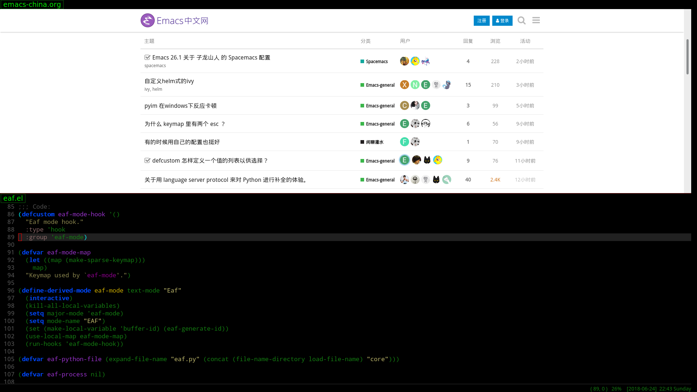
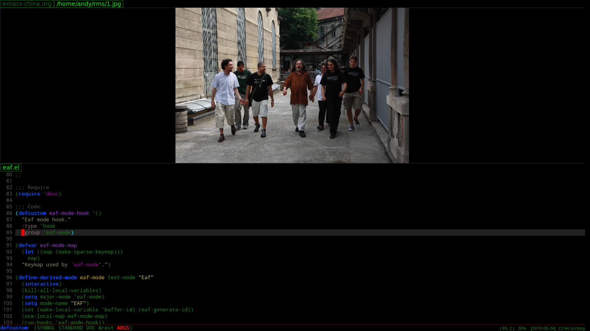

# What is Emacs Application Framework?
Emacs Application Framework is a development framework that developers can develop any PyQt program and integrate into Emacs.

This framework mainly implements three functions:
1. Integrate PyQt program window into Emacs Frame using Xlib Reparent technology
2. Listening to EAF buffer's keyboard event flow and controlling the keyboard input of PyQt program via DBus IPC
3. Created a window compositer to make the PyQt program window adapt Emacs's Window/Buffer design

Using this framework, you can use PyQt develop powerful graphics programs to extend Emacs

## Some screenshots

### Browser


### Image Viewer


### Video Player


## Installation

1. Install PyQt5 and Python-Xlib (below commands use for archlinux)
```Bash
sudo pacman -S python-xlib python-pyqt5
```

2. Clone this repository and add below code in your ~/.emacs
```Elisp
(require 'eaf)
```

## Usage

```
M-x eaf-open
```

Such as,
* type www.google.com to open browser
* type /path/image.jpg to open image viewer, and press key j or k to select other image in same directory
* type /path/video.ogg to open video player, video player only support ogg file because it implement by HTML5 video tag

## Join Us
Do you want to make Emacs a real operating system?

Do you want to live in emacs more comfortably?

Want to create unparalleled plugins to extend emacs?

*Join us!*

## How to develop new plugins?

1. Create new python plugin file:
```Bash
mkdir -p emacs-application-framework/app/foo/buffer.py
```

2. Fill python file with below template:
```Python
from PyQt5.QtGui import QColor
from PyQt5.QtWidgets import QLabel
from buffer import Buffer

class FooBuffer(Buffer):
    def __init__(self, buffer_id, url, width, height):
        Buffer.__init__(self, buffer_id, url, width, height, QColor(255, 255, 255, 255))
        
        self.buffer_widget = QLabel("foo")
        self.buffer_widget.resize(self.width, self.height)
        
    def resize_buffer(self, width, height):
        self.width = width
        self.height = height
        self.buffer_widget.resize(self.width, self.height)
        
```

3. Open emacs-application-framework/core/eaf.py

    Add import code to import plugin buffer:
```Python
from app.foo.buffer import FooBuffer
```

    Research function `new_buffer`, you can launch new plugin when user input some file, like below:
```Python
...

if url.endswith(".foo"):
    self.buffer_dict[buffer_id] = FooBuffer(buffer_id, url, emacs_width, emacs_height)

...
```

4. Try new plugins:

    You need call command `eaf-stop-process` to kill old python process first.
    
    Then call command `eaf-open' to test.

## Todo list
* Browser: click to open link in new tab 
* Browser: update title after load finish
* Browser: add progressbar
* Browser: add cookie support
* ImageViewer: add zoom support
* VideoPlayer: use mpv or vlc instead html5 video tag

## Contact me

lazycat dot manatee at gmail dot com

Any suggestions and patches are welcome, happy hacking!
