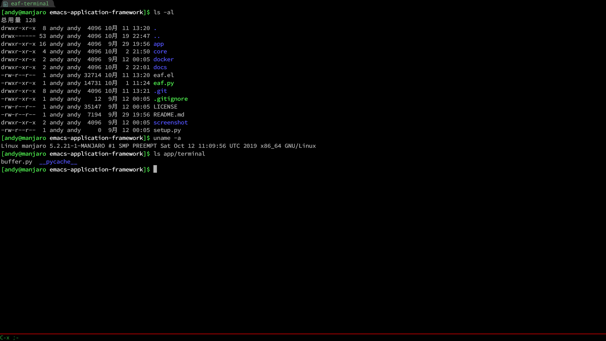

# What is Emacs Application Framework?
Emacs Application Framework (EAF) is an application framework that extend GNU Emacs to an entire new universe of powerful GUI PyQt applications.

EAF is also super extensible, developers can develop any PyQt program, and integrate it into Emacs through EAF.

This framework mainly implements three functions:
1. Integrate PyQt program window into Emacs Frame using Xlib Reparent technology
2. Listening to EAF buffer's keyboard event flow and controlling the keyboard input of PyQt program via DBus IPC
3. Created a window compositer to make the PyQt program window adapt Emacs's Window/Buffer design

## Some Screenshots

| Browser                                          | Markdown Previewer                                          |
| :--------:                                       | :----:                                                      |
|  |  |

| Image Viewer                                          | Video Player                                          |
| :--------:                                            | :----:                                                |
|  |  |
|                                                       |                                                       |

| PDF Viewer                                          | Camera                                          |
| :--------:                                          | :----:                                          |
|  |  |
|                                                     |                                                 |

| File Sender                                            | File Receiver                                          |
| :--------:                                             | :----:                                                 |
|  |  |
|                                                        |                                                        |


| Air Share                                          | Org Previewer                                          |
| :--------:                                         | :--------:                                             |
|  |  |
|                                                    |                                                        |

| Terminal Emulator                                 |
| :--------:                                        |
|  |
|                                                   |

## Installation

1. Install python dependences:

```Bash
    sudo pip3 install dbus-python pymupdf grip qrcode python-xlib pyqt5 pyqtwebengine
```

2. Install QTermWidget's Python binding:

```Bash
git clone https://github.com/lxqt/qtermwidget.git --depth=1
mkdir build && cd build
cmake .. -DQTERMWIDGET_BUILD_PYTHON_BINDING=ON -DCMAKE_INSTALL_PREFIX=/usr -DCMAKE_INSTALL_LIBDIR=/usr
make
sudo make install
```

3. Clone this repository and add below code in `.emacs`

```Elisp
(require 'eaf)
```

A `use-package` sample configuration
```Elisp
(use-package eaf
  :load-path "~/.emacs.d/site-lisp/emacs-application-framework"
  :custom
  (eaf-find-alternate-file-in-dired t)
  :config
  (eaf-bind-key scroll_up "RET" eaf-pdf-viewer-keybinding)
  (eaf-bind-key scroll_down_page "DEL" eaf-pdf-viewer-keybinding)
  (eaf-bind-key scroll_up "C-n" eaf-pdf-viewer-keybinding)
  (eaf-bind-key scroll_down "C-p" eaf-pdf-viewer-keybinding)
  (eaf-bind-key take_photo "p" eaf-camera-keybinding)
  (defun eaf-open-google ()
    "Open Google using EAF."
    (interactive)
    (eaf-open-browser "https://www.google.com")))
```

### Package Description

| Debian Package  | Package Repo        | Use for                                          |
| :--------       | :--------           | :----                                            |
| dbus-python     | pip3                | DBus IPC for python and elisp                    |
| pymupdf         | pip3                | Render engine required for PDF Viewer            |
| grip            | pip3                | Markdown render server for Markdown Previewer    |
| qrcode          | pip3                | Render local file QR code                        |
| python-xlib     | pip3                | Stick app window into emacs frame                |
| pyqt5           | pip3                | GUI library required for application development |
| pyqtwebengine   | pip3                | QtWebEngine for browser application              |
| qtermwidget-git | source code compile | QTermWidget is terminal emulator for PyQt5       |

### You can choose to run EAF with docker@

If you prefer to run linux in a docker, you can read [Run EAF with docker](./docker/README.md)

### Why this awesome framework doesn't works with MacOS or Windows?
There are mainly three obstacles:
1. I can't make dbus/python-dbus works on MacOS High Sierra
2. This framework need use X11 reparent to stick Qt5 window to emacs frame, but I don't know how to make X11 works on MacOS.
3. Qt5 QGraphicsView/QGraphicsScene can't work MacOS, specify QGraphicsVideoItem can't work.
4. If you figure them out, PR always welcome

## Usage

| Application Name   | Launch                                        |
| :--------          | :----                                         |
| Browser            | Type 'eaf-browser' RET https://www.google.com |
| PDF Viewer         | Type 'eaf-open' RET pdf filepath              |
| Video Player       | Type 'eaf-open' RET video filepath            |
| Image Viewer       | Type 'eaf-open' RET image filepath            |
| Markdown previewer | Type 'eaf-open' RET markdown filepath         |
| Org file previewer | Type 'eaf-open' RET org filepath              |
| Camera             | Type 'eaf-open-camera'                        |
| Terminal           | Type 'eaf-open-terminal'                      |
| File Sender        | Type 'eaf-file-sender-qrcode'                 |
|                    | Or use 'eaf-file-sender-qrcode-in-dired'      |
| File Receiver      | Type 'eaf-file-receiver-qrcode'               |
| Airshare           | Type 'eaf-file-transfer-airshare'             |
| Demo               | Type 'eaf-open-demo'                          |

Please check [Key binding](./docs/KEYBINDING.md) to check keybinding of application.

```
NOTE:
EAF use DBus' session bus, it must running in general user.
Please don't run EAF with root user, root user just can access DBus's system bus.
```

## Settings

### Keybindings
There are default keybindings for each EAF application provided by us. If you want to see them all, execute `(describe-mode)` or `C-h m` within an EAF buffer.

You can easily customize EAF keybindings, find the corresponding keybinding variable, and add the something like the following to `.emacs`
```Elisp
(eaf-bind-key scroll_up "C-n" eaf-pdf-viewer-keybinding)
(eaf-bind-key scroll_down "C-p" eaf-pdf-viewer-keybinding)
(eaf-bind-key take_photo "p" eaf-camera-keybinding)
```

Currently available keybinding variables are `eaf-browser-keybinding`, `eaf-pdf-viewer-keybinding`, `eaf-video-player-keybinding`, `eaf-image-viewer-keybinding`, `eaf-camera-keybinding`, `eaf-terminal-keybinding`.

### Variable Customization
There are certain variables will be shared across Emacs Lisp and Python. You can easily configure then with `eaf-setq`.

Check the full list of configurable variables with `C-h v eaf-var-list`.

#### EAF Browser
To set EAF Browser as your default browser, put the following in your `.emacs`
```Elisp
(setq browse-url-browser-function 'eaf-open-browser)
(defalias 'browse-web 'eaf-open-browser)
```

Default browser enable plugin and JavaScript, to disable them, you can add something like the following to `.emacs`

```Elisp
(eaf-setq eaf-browser-enable-plugin "false")
(eaf-setq eaf-browser-enable-javascript "false")
```

#### EAF Camera
The default directory to store images taken by EAF Camera is `~/Downloads`. To modify it, add the something like the following to `.emacs`

```Elisp
(eaf-setq eaf-camera-save-path "new/path/")
```

### Proxy
If you can't access most awesome internet services like me, you perhaps need proxy settings like below:

```Elisp
(setq eaf-http-proxy-host "127.0.0.1")
(setq eaf-http-proxy-port "1080")
```

Then EAF browser is working! ;)

### Markdown Previewer
If you use markdown previewer, you need the access to a [Personal access token](https://github.com/settings/tokens/new?scopes=), fill something in "Token description" and click button "Generate token" to get your personal token, then set token with code:

```Elisp
(setq eaf-grip-token "yourtokencode")
```

Otherwise, github will popup "times limit" error because so many people use grip. ;)

## FAQ

### How about EXWM? What makes EAF special?
1. EAF gives you control over your program, while satisfying Emacs window design model. [EXWM](https://github.com/ch11ng/exwm) is only a tiling WM, that combines different applications together in an Emacs-like fashion. However, EXWM is unable to split the same application into two different windows while displaying different parts of the same application at the same time. For example, EAF is able to display different pages of the same PDF on two different windows.
2. EAF essentially provides Emacs a secondary scripting language ([This topic has been brought up in EmacsConf2019](https://media.emacsconf.org/2019/26.html) and [reddit](https://www.reddit.com/r/emacs/comments/e1wfoe/emacs_the_editor_for_the_next_40_years/)). Emacs Lisp doesn't render graphics very well, especially it doesn't play nicely with the browser. This is (an example of) where PyQt5 can come in handy.
3. With DBus IPC, EAF can use Python to control Emacs Lisp, conversely also true that Emacs Lisp can control Qt rendering and Python code.
4. EXWM, as a Windows Manager, does its job very well. Therefore, it doesn't have control and doesn't care at all how other program functions. For example, EXWM cannot control keyboard events of other programs. On the other hand, you can configure them in EAF either using existing features (see above) or write code to contribute to this repository.
5. From a higher point of view, EAF is using Emacs' design principles to extend GUI programs. You have the ability to control good GUI programs using Emacs keybindings. To achieve the ultimate goal: live in Emacs ;)

### Why not support Wayland?
EAF use X11 XReparent technology to stick Qt5 window on Emacs buffer area, Wayland not support XReparent.

I recommend you use KDE, it's stable enough and support X11 XReparent technology.

### "undefined symbol" error
If you got "undefined symbol" error after start EAF, and you use Arch Linux, yes, it's a bug of Arch.

You need use pip install all dependences after you upgrade your Arch system, then undefine symbol error will fix.

## Report bug
If you got ```*eaf* aborted``` error, please check buffer ```*eaf*``` first, mostly because Python library dependencies is not installed successfully.

If you have any problem with EAF, please use command "emacs -Q" to start Emacs without any customizations.

Then re-test your workflow. If "emacs -Q" works fine, it's must be something wrong with your emacs config file.

If the problem persists, please [report bug here](https://github.com/manateelazycat/emacs-application-framework/issues/new).

## Join Us
Do you want to make Emacs a real operating system?

Do you want to live in emacs more comfortably?

Want to create unparalleled plugins to extend emacs?

[Let's hack together!](./docs/HACKING.md)

## 打赏
如果我的作品让你的生活充满快乐, 欢迎请我喝瓶啤酒, 哈哈哈哈

<p float="left">
    
    
</p>
