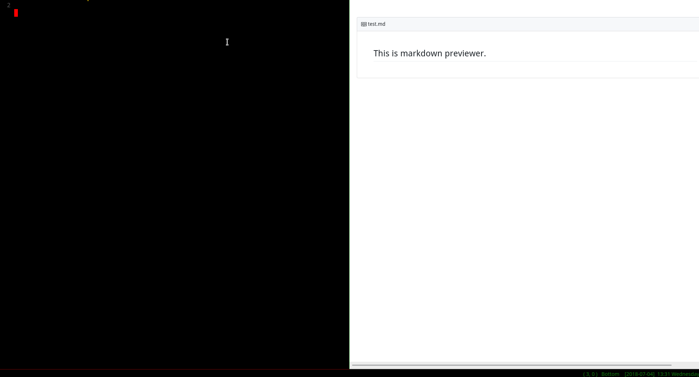
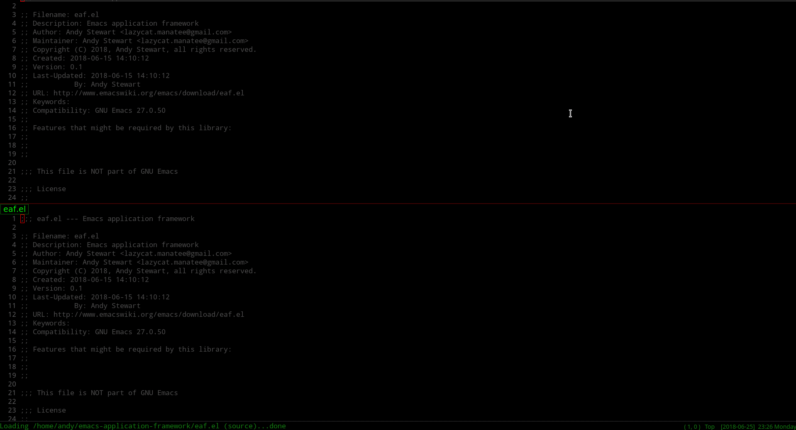
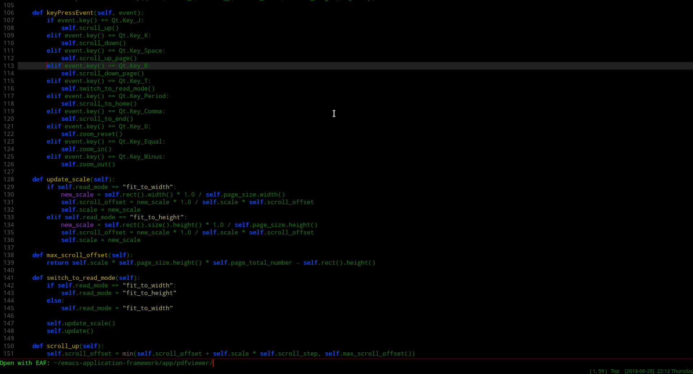
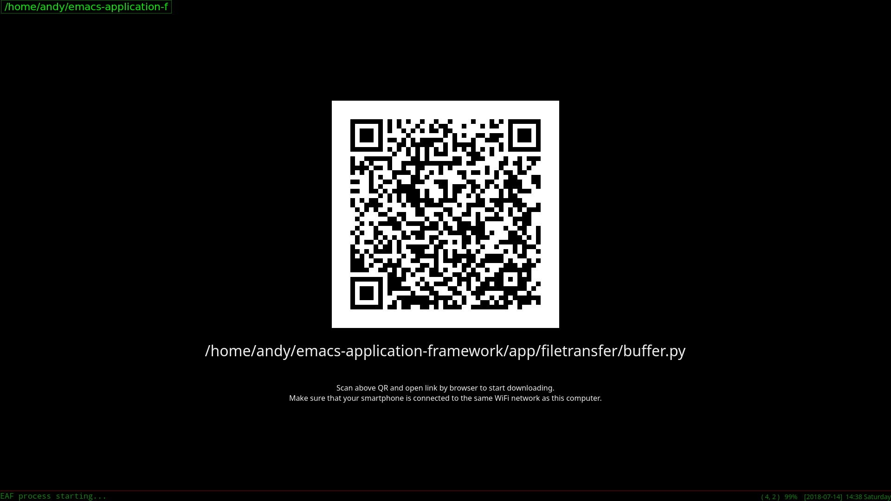
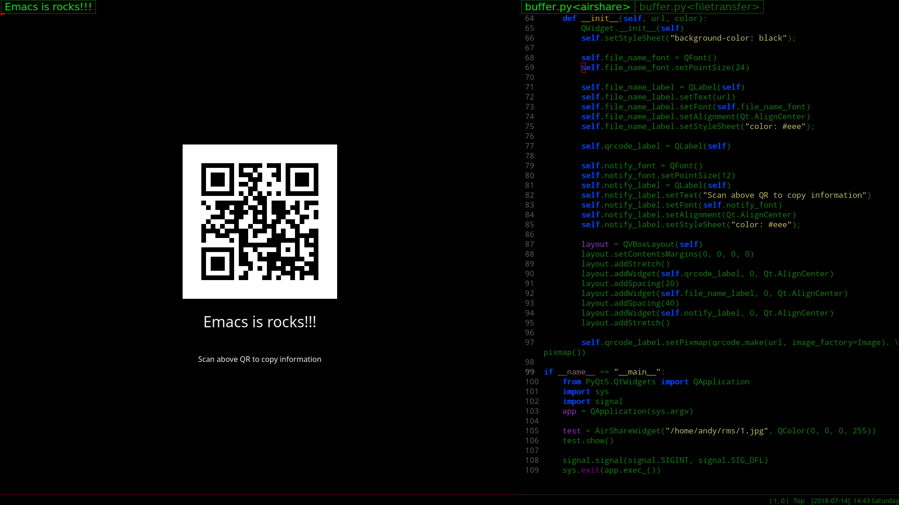
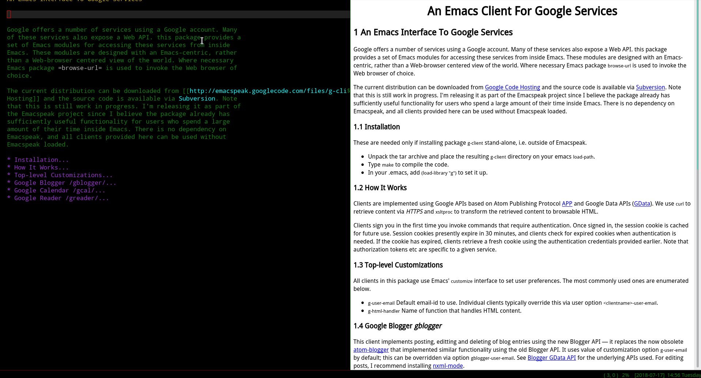
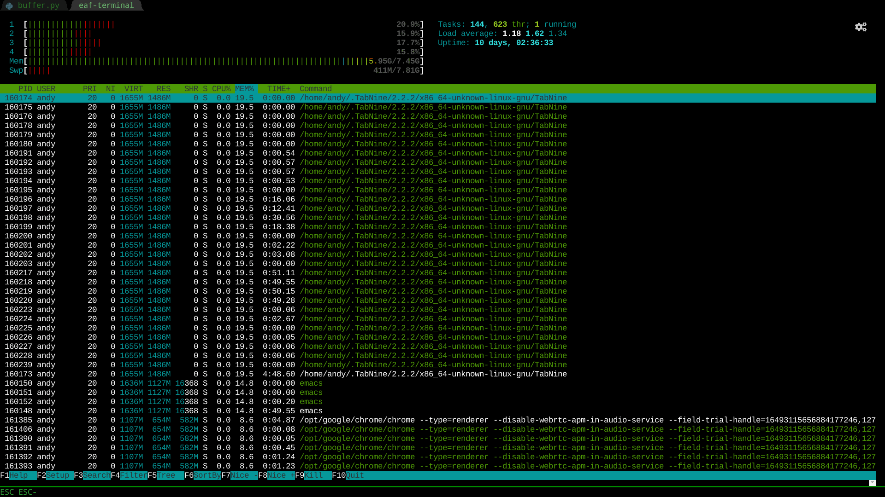
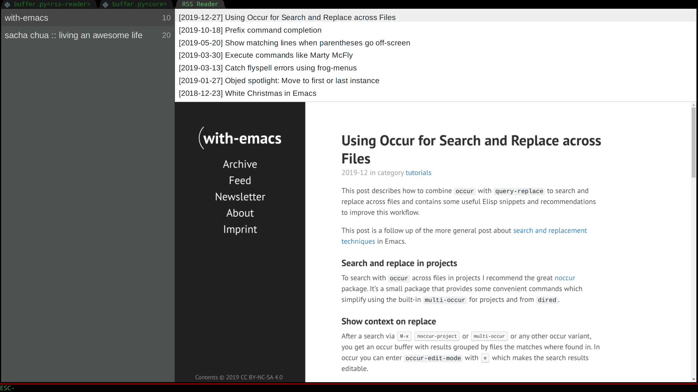

# What is Emacs Application Framework (EAF)?
EAF extends GNU Emacs to an entire universe of powerful GUI applications.

## EAF Application Overview
EAF is extensible, you can develop any PyQt application and integrate it into Emacs.

| Browser                                          | Markdown Previewer                                          |
| :--------:                                       | :----:                                                      |
|  |  |

| Image Viewer                                          | Video Player                                          |
| :--------:                                            | :----:                                                |
|  |  |
|                                                       |                                                       |

| PDF Viewer                                          | Camera                                          |
| :--------:                                          | :----:                                          |
|  |  |
|                                                     |                                                 |

| File Sender                                            | File Receiver                                          |
| :--------:                                             | :----:                                                 |
|  |  |
|                                                        |                                                        |


| Air Share                                          | Org Previewer                                          |
| :--------:                                         | :--------:                                             |
|  |  |
|                                                    |                                                        |

| Terminal Emulator                                 | RSS Reader                                          |
| :--------:                                        | :------:                                            |
|  |  |
|                                                   |                                                     |

## Install EAF
1. Clone this repository, add to ```load-path```, and add the following to ```.emacs```

```Elisp
(require 'eaf)
```

If you use [use-package](https://github.com/jwiegley/use-package), a sample configuration has been provided.

```Elisp
(use-package eaf
  :load-path "~/.emacs.d/site-lisp/emacs-application-framework"
  :custom
  (eaf-find-alternate-file-in-dired t)
  :config
  (eaf-bind-key scroll_up "RET" eaf-pdf-viewer-keybinding)
  (eaf-bind-key scroll_down_page "DEL" eaf-pdf-viewer-keybinding)
  (eaf-bind-key scroll_up "C-n" eaf-pdf-viewer-keybinding)
  (eaf-bind-key scroll_down "C-p" eaf-pdf-viewer-keybinding)
  (eaf-bind-key take_photo "p" eaf-camera-keybinding))
```

2. Make sure to have ```python3``` installed, and use ```pip3``` to install EAF dependencies (see below list for details):

```Elisp
sudo pip3 install dbus-python python-xlib pyqt5 pyqtwebengine pymupdf grip qrcode feedparser
```

3. (For EAF Terminal to work *only*) Install and configure ```wetty```:
```Bash
# Install wetty
sudo yarn global add wetty

# Make wetty login with public key
ssh-keygen
cp ~/.ssh/id_rsa.pub ~/.ssh/authorized_keys

# You need add below in .bashrc if you are Chinese
echo 'export LANG=zh_CN.UTF-8' >> ~/.bashrc
```

### Dependency List
Packages listed as **Core** are mandatory to make EAF to work, whereas packages listed as **Application** are optional - install if you want the corresponding EAF feature.

| Package       | Package Repo | Classification | Description and Depended by ...                         |
| :--------     | :----        | :------        | :------                                                 |
| pyqt5         | pip3         | Core           | Essential GUI library                                   |
| dbus-python   | pip3         | Core           | DBus IPC to connect Python with Elisp                   |
| python-xlib   | pip3         | Core           | Stick application window into Emacs frame               |
| pyqtwebengine | pip3         | Core           | Depended by EAF Browser and some other EAF Applications |
| pymupdf       | pip3         | Application    | Depended by EAF PDF Viewer                              |
| grip          | pip3         | Application    | Depended by EAF Markdown Previewer                      |
| qrcode        | pip3         | Application    | Depended by EAF File Transfer                           |
| feedparser    | pip3         | Application    | Depended by EAF RSS Reader                              |
| wetty         | yarn         | Application    | Depended by EAF Terminal                                |

## Launch EAF Applications
| Application Name    | Launch                                                                 |
| :--------           | :----                                                                  |
| Browser             | `M-x eaf-open-browser` Search or Goto URL                              |
|                     | `M-x eaf-open-browser-with-history` Search or Goto URL or Goto History |
| HTML Email Renderer | `M-x eaf-open-mail-as-html` in `gnus`, `mu4e`, `notmuch` HTMl Mail     |
| PDF Viewer          | `M-x eaf-open` PDF File                                                |
| Video Player        | `M-x eaf-open` Video File                                              |
| Image Viewer        | `M-x eaf-open` Image File                                              |
| Markdown Previewer  | `M-x eaf-open` Markdown File                                           |
| Org Previewer       | `M-x eaf-open` Org File                                                |
| Camera              | `M-x eaf-open-camera`                                                  |
| Terminal            | `M-x eaf-open-terminal`                                                |
| File Sender         | `M-x eaf-file-sender-qrcode` or `eaf-file-sender-qrcode-in-dired`      |
| File Receiver       | `M-x eaf-file-receiver-qrcode`                                         |
| Airshare            | `M-x eaf-open-airshare`                                                |
| RSS Reader          | `M-x eaf-open-rss-reader`                                              |
| Demo                | `M-x eaf-open-demo` to verify basic functionality                      |

- To open the file under the cursor in `dired` using EAF, use `eaf-open-this-from-dired` instead.

```
NOTE:
EAF use DBus' session bus, it must run in general user.
Please don't run EAF with root user, a root user can only access DBus's system bus.
```

## Wiki
Please check the [Wiki](https://github.com/manateelazycat/emacs-application-framework/wiki) for documentations on Keybinding, Customization, EAF Structure and TODOLIST.

You can also find helpful config tips to make EAF work with Docker, Helm.

## FAQ and Support

### How does EAF make this possible?
EAF implements three major functionalities:
1. Integrate PyQt program window into Emacs frame using Xlib Reparent technology.
2. Listen to EAF buffer's keyboard event flow and control the keyboard input of PyQt program via DBus IPC.
3. Create a window compositer to make a PyQt program window adapt Emacs's Window/Buffer design.

### How about EXWM? What makes EAF special?
1. EAF gives you control over your program, while satisfying Emacs window design model. [EXWM](https://github.com/ch11ng/exwm) is only a Windows Manager, that combines different applications together in an Emacs-like fashion. EXWM is unable to split the same application into two different windows while displaying the same application in parallel. On the other hand, EAF is able to display the same PDF on two different windows.
2. EAF essentially provides Emacs a secondary scripting language ([this topic had been brought up again in EmacsConf2019](https://media.emacsconf.org/2019/26.html) and [reddit](https://www.reddit.com/r/emacs/comments/e1wfoe/emacs_the_editor_for_the_next_40_years/)). Emacs Lisp doesn't render graphics very well, especially it doesn't play nicely with the browser. This is (an example of) where PyQt5 can come in handy.
3. With DBus IPC, EAF can use Python to control Emacs Lisp, conversely also true that Emacs Lisp can control Qt rendering and Python code.
4. EXWM, as a Windows Manager, does its job very well. Therefore, it doesn't have control and doesn't care at all how other program functions. For example, EXWM cannot control keyboard events of other programs. On the other hand, you can configure them in EAF either using existing features (see above) or write code to contribute to this repository.
5. From a higher point of view, EAF is using Emacs' design principles to extend GUI programs. You have the ability to control good GUI programs using Emacs keybindings. To achieve the ultimate goal: live in Emacs ;)

### EAF is (currently) Linux only. Why?
There are mainly three obstacles:
1. None of EAF's core developers use MacOS or Windows or BSD family OS.
2. EAF uses X11 Reparent to stick Qt5 window to emacs frame, struggling to make X11 to work on MacOS.
3. Strugglling to make dbus/python-dbus work on MacOS High Sierra
4. Strugglling to make Qt5 QGraphicsView/QGraphicsScene work on MacOS, specifically QGraphicsVideoItem cannot work.
5. If you've figure them out, PRs are always welcome

### How about Wayland?
EAF use X11 XReparent, Wayland doesn't support it as of now.

We recommend to use KDE out of all DEs, it's stable enough and supports X11 XReparent. You will get the best support because we ourselves use it.

### `[EAF] *eaf* aborted (core dumped)`
Please check the `*eaf*` buffer, something is wrong on the Python side. Usually due to Python dependencies are not installed correctly.

### "undefined symbol" error
If you got "undefined symbol" error after start EAF, and you use Arch Linux, yes, it's a bug of Arch.

You need use pip install all dependences after you upgrade your Arch system, then undefine symbol error will fix.

```Elisp
sudo pip3 install dbus-python python-xlib pyqt5 pyqtwebengine pymupdf grip qrcode feedparser --force-reinstall
```

### Github Personal Access Tokens?
If you use EAF Markdown Previewer, you need the access to a [Personal access token](https://github.com/settings/tokens/new?scopes=), fill something in "Token description" and click button "Generate token" to get your personal token, then set token:

```Elisp
(setq eaf-grip-token "yourtokencode")
```

Otherwise, github might popup "times limit" error because there are just so many people using grip. ;)

### Proxy
If you need to use proxy to access internet, you can configure the proxy settings.

```Elisp
(setq eaf-proxy-type "http")
(setq eaf-proxy-host "127.0.0.1")
(setq eaf-proxy-port "1080")
```

If you use Socks5 as local proxy, you can set proxy type with:

```Elisp
(setq eaf-proxy-type "socks5")
```

## EAF in the community

A list of other community packages that use EAF to enhance their graphical experiences!

If we missed your package, please make a PR to add it to the list.

* ***[obr-viz](https://github.com/swhalemwo/obr-viz)***: visualizing [org-brain](https://github.com/Kungsgeten/org-brain) relationships using EAF

## Report bug

For any installation and configuration assistance, please read the [Wiki](https://github.com/manateelazycat/emacs-application-framework/wiki) first!

If you encounter any problem with EAF, please use command `emacs -q` with minimal setups and re-test to see if the bug is reproducible. If `emacs -q` works fine, probably something is wrong with your emacs config.

If the problem persists, please [report bug here](https://github.com/manateelazycat/emacs-application-framework/issues/new).

## Join Us
Do you want to make Emacs a real operating system?

Do you want to live in Emacs more comfortably?

Want to create unparalleled plugins to extend Emacs?

[Let's hack together!](https://github.com/manateelazycat/emacs-application-framework/wiki/Hacking)

## 打赏
如果我的作品让你的生活充满快乐, 欢迎请我喝瓶啤酒, 哈哈哈哈

<p float="left">
    
    
</p>
