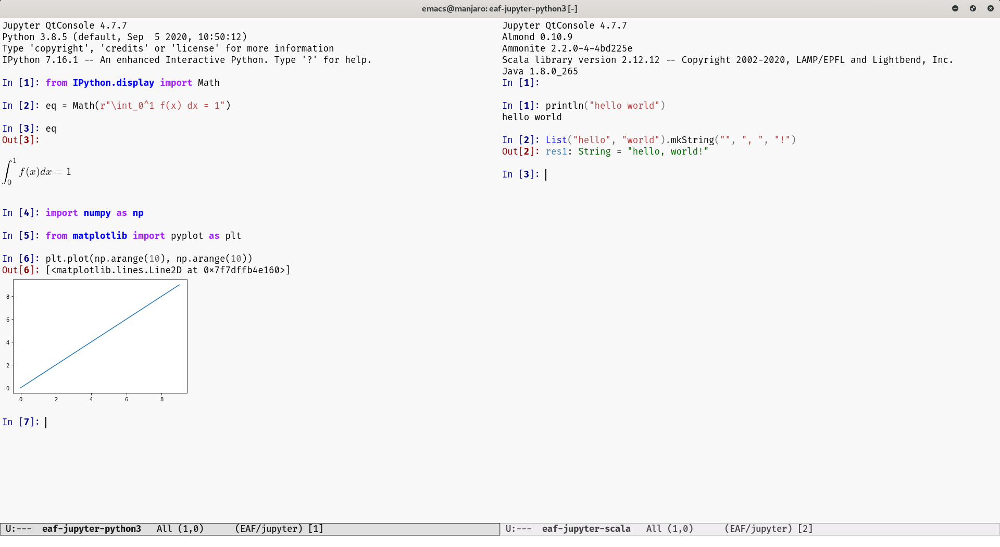

English | [简体中文](./README.zh-CN.md)

# Emacs Application Framework (EAF)
EAF is a GUI application framework that revolutionizes Emacs graphical capabilities to ultimately *Live in Emacs*.

## EAF Application Overview
EAF is an extensible framework, one can develop any Qt5 application and integrate it into Emacs.

| Browser                                          | Markdown Previewer                                          |
| :--------:                                       | :----:                                                      |
|  |  |

| Image Viewer                                          | Video Player                                          |
| :--------:                                            | :----:                                                |
|  |  |
|                                                       |                                                       |

| PDF Viewer                                          | Camera                                          |
| :--------:                                          | :----:                                          |
|  |  |
|                                                     |                                                 |

| File Sender                                            | File Receiver                                          |
| :--------:                                             | :----:                                                 |
|  |  |
|                                                        |                                                        |


| Air Share                                          | Org Previewer                                          |
| :--------:                                         | :--------:                                             |
|  |  |
|                                                    |                                                        |

| Terminal Emulator                                 | RSS Reader                                          |
| :--------:                                        | :------:                                            |
|  |  |
|                                                   |                                                     |

| Aria2 Download Manager                         | Mind Map  |
| :--------:                                     | :-------: |
|  |  |
|                                                |           |


| Mermaid                                          | EAF Interleave                                          |
| :--------:                                       | :----------:                                            |
|  |  |
|                                                  |                                                         |

| Jupyter                                          |                                                         |
| :--------:                                       | :----------:                                            |
|  |                                                         |
|                                                  |                                                         |

## Install
1. Install EAF dependencies, an explaination of each dependency can be found in [Dependency List](#dependency-list).

The following line is for *Arch*-based distros, same packages should be available to install on your particular distribution:

```Bash
yay -S python-pyqt5 python-pyqt5-sip python-pyqtwebengine python-qrcode python-feedparser python-dbus python-pyinotify python-markdown nodejs aria2 libreoffice python-grip python-qtconsole filebrowser-bin wmctrl
```

You need install pymupdf from pip to avoid undefined symbol ```jbig2_page_out``` error.
```
sudo pacman -R python-pymupdf
pip uninstall fitz
pip install pymupdf
```

2. For installing EAF, there are two routes:
Please make sure to modify `~/emacs.d/site-lisp` as per your Emacs setup.
- *Git Clone*:
```Bash
git clone https://github.com/manateelazycat/emacs-application-framework.git --depth=1 ~/.emacs.d/site-lisp/
```

- *Quick Install*:
```Bash
wget https://github.com/manateelazycat/emacs-application-framework/archive/master.zip
unzip master.zip && mkdir -p ~/.emacs.d/site-lisp && mv emacs-application-framework-master ~/.emacs.d/site-lisp/emacs-application-framework
```
Use *Quick Install* option if you want to quickly install EAF source code and try it out.

3. From here on, you can either Add the full path to the EAF installation directory to your Emacs ```load-path```, then add the following to `init.el`:

```Elisp
(add-to-list 'load-path "~/.emacs.d/site-lisp/emacs-application-framework/"')
(require 'eaf)
```
or,
If you use [use-package](https://github.com/jwiegley/use-package), you can use the following *sample* configuration for your convenience.

```Elisp
(use-package eaf
  :load-path "~/.emacs.d/site-lisp/emacs-application-framework" ; Set to "/usr/share/emacs/site-lisp/eaf" if installed from AUR
  :custom
  (eaf-find-alternate-file-in-dired t)
  :config
  (eaf-bind-key scroll_up "C-n" eaf-pdf-viewer-keybinding)
  (eaf-bind-key scroll_down "C-p" eaf-pdf-viewer-keybinding)
  (eaf-bind-key take_photo "p" eaf-camera-keybinding))
```

### Dependency List

Packages listed as **Core** are mandatory for EAF to work, whereas other packages are optional - install if you want to use corresponding EAF Application.

| Package                        | Dependent                            | Description                                   |
| :--------                      | :------                              | :------                                       |
| python-pyqt5, python-pyqt5-sip | Core                                 | Essential GUI library                         |
| python-dbus                    | Core                                 | DBus IPC to connect Python with Elisp         |
| python-pyqtwebengine           | Core                                 | Chromium based web rendering engine           |
| wmctrl           | Core                                 | Activate Emacs window input focus           |
| python-pymupdf                 | PDF Viewer                           | PDF rendering engine                          |
| python-grip                    | Markdown Previewer                   | Markdown rendering server                     |
| python-qrcode                  | File Sender, File Receiver, Airshare | Render QR code pointing to local files        |
| python-feedparser              | RSS Reader                           | Parse RSS feeds                               |
| python-pyinotify               | Mermaid                              | Monitor *.mmd file change status              |
| python-markdown                | Mermaid                              | Covert markdown format to mermaid html format |
| nodejs                         | Terminal                             | Communicate between browser and local TTY     |
| aria2                          | Browser                              | Download files from the web                   |
| libreoffice                    | Doc Viewer                           | Convert doc file to pdf                       |
| filebrowser-bin                | File Browser                         | Share files between computer and smartphone   |
| qtconsole                      | Jupyter                              | Provide RichJupyterWidget                     |

## Launch EAF Applications
| Application Name    | Launch                                                                 |
| :--------           | :----                                                                  |
| Browser             | `M-x eaf-open-browser` Search or Goto URL                              |
|                     | `M-x eaf-open-browser-with-history` Search or Goto URL or Goto History |
| HTML Email Renderer | `M-x eaf-open-mail-as-html` in `gnus`, `mu4e`, `notmuch` HTMl Mail     |
| PDF Viewer          | `M-x eaf-open` PDF File                                                |
| Video Player        | `M-x eaf-open` Video File                                              |
| Image Viewer        | `M-x eaf-open` Image File                                              |
| Markdown Previewer  | `M-x eaf-open` Markdown File                                           |
| Org Previewer       | `M-x eaf-open` Org File                                                |
| Camera              | `M-x eaf-open-camera`                                                  |
| Terminal            | `M-x eaf-open-terminal`                                                |
| File Sender         | `M-x eaf-file-sender-qrcode` or `eaf-file-sender-qrcode-in-dired`      |
| File Browser        | `M-x eaf-file-browser-qrcode`                                          |
| Airshare            | `M-x eaf-open-airshare`                                                |
| RSS Reader          | `M-x eaf-open-rss-reader`                                              |
| Mindmap             | `M-x eaf-create-mindmap` or `M-x eaf-open-mindmap`                     |
| MS Office Viewer    | `M-x eaf-open-office`                                                  |
| Mermaid             | `M-x eaf-open` Mermaid file (*.mmd)                                    |
| Jupyter             | `M-x eaf-open-jupyter`                                                 |
| Demo                | `M-x eaf-open-demo` to verify basic functionality                      |

- To open the file under the cursor in `dired` using appropriate EAF Application, use `eaf-open-this-from-dired` instead.
- EAF Browser and PDF Viewer support Emacs built-in bookmark operation, with `M-x bookmark-set` (defaulted to `C-x r m`) and `M-x bookmark-bmenu-list` (defaulted to `C-x r l`).

```
NOTE:
EAF use DBus' session bus, it must run by a general user.
Please don't use EAF when Emacs is started with sudo or root user, a root user can only access DBus's system bus.
```

## Wiki

It is **highly** suggested to read the [Wiki](https://github.com/manateelazycat/emacs-application-framework/wiki) first before using EAF.

Wiki consists of documentations on:
* Keybindings
* Customization
* Design
* TODOLIST

There also are some helpful tips to make EAF work with Docker, Helm, etc.

## FAQ

### How does EAF work?
EAF implements three major functionalities:
1. Integrate PyQt program window into Emacs frame using QWindow Reparent technology.
2. Listen to EAF buffer's keyboard event flow and control the keyboard input of PyQt program via DBus IPC.
3. Create a window compositer to make a PyQt program window adapt Emacs's Window/Buffer design.

Learn more from the [Wiki](https://github.com/manateelazycat/emacs-application-framework/wiki/Hacking)!

### EAF vs EXWM?
1. EAF and EXWM share a common goal: enhance collaboration between the standard GNU Emacs with other GUI tools.
2. EXWM is an X11 Window Manager, it manages and controls other software using a keyboard, but it cannot modify, customize and extend the behavior of other software.
3. EAF is *not* a Window Manager, it utilizes the windows managing capabilities of Emacs to display its applications.
4. The intention of EAF is to provide a framework to write PyQt5 applications that extends the multimedia experience of Emacs. From the perspective of Emacs' buffer/mode design, EAF is not different from any other package, with the former uses Qt for drawing contents while the latter uses Emacs' built-in text libraries instead.
5. Through EAF's design, one can use Elisp to control Python and vice versa, and even able to use Elisp to control JavaScript in EAF Browser. EAF enables Emacs to the world of **multi-language scripting**.

Both projects are similar in terms of interface, but they are two completely different projects with different goals in mind. Sometimes one may find EAF is more suitable than EXWM, sometimes it's the other way around. Please do not meaninglessly compare them.

### EAF is (currently) Linux only. Why?
1. DBus is Linux-specific technology, it's difficult to support DBus in other operating systems.
2. Qt5's QGraphicsScene technology does not work on MacOS.

If you've figure them out, PRs are always welcome!

### Why doesn't EAF receive input events on WM?
EAF confirms that the desktop environment or window manager you can work includes: KDE, GNOME2, GNOME3, Mate, Xfce, LXDE, I3, QTILE.

We suspect there are some issues with how all the Window Managers implement their x11 protocols.

One workaround is to add `$DESKTOP_SESSION` environment variable to the elisp list `eaf-wm-focus-fix-wms`. Fill an issue if it still doesn't work.

### `[EAF] *eaf* aborted (core dumped)` error
Please check the `*eaf*` buffer, something is wrong on the Python side. Usually due to Python dependencies are not installed correctly.

If you're sure Python dependences are installed correctly, please create an issue with the `*eaf*` buffer content, it contains many clues that can help us locate the problem faster.

### What is Github Personal Access Tokens?
If you use EAF Markdown Previewer, to get consistent previewing, you need to access [Github Personal access token site](https://github.com/settings/tokens/new?scopes=), fill something in "Token description" and click button "Generate token" to get your personal token. Then set the token:

```Elisp
(setq eaf-grip-token "yourtokencode")
```

Although Markdown Previewer works for the first few times by entering empty string when prompted, eventually it stops working and gives "GitHub Rate Limit Reached" error.

### Proxy
If you need to use proxy to access internet, one can configure the proxy settings.

```Elisp
(setq eaf-proxy-type "http")
(setq eaf-proxy-host "127.0.0.1")
(setq eaf-proxy-port "1080")
```

If you use Socks5 as local proxy, one can set proxy type with:

```Elisp
(setq eaf-proxy-type "socks5")
```

## EAF in the community

A list of other community packages that use EAF to enhance their graphical experiences!

If we missed your package, please make a PR to add it to the list.

* ***[obr-viz](https://github.com/swhalemwo/obr-viz)***: visualizing [org-brain](https://github.com/Kungsgeten/org-brain) relationships using EAF

## Report bug

For any installation and configuration assistance, please read the [Wiki](https://github.com/manateelazycat/emacs-application-framework/wiki) first!

If you encounter any problem with EAF, please use command `emacs -q` with a minimal setup that only contains EAF and verify the bug is reproducible. If `emacs -q` works fine, probably something is wrong with your Emacs config.

If the problem persists, please [report bug here](https://github.com/manateelazycat/emacs-application-framework/issues/new).

If you got segfault error, please use the following way to collect crash information:
1. Install gdb and turn on option `eaf-enable-debug`
2. Use command `eaf-stop-process` stop current process
3. Restart eaf, send issue with `*eaf*` buffer content when next crash

## Join Us
Do you want to make Emacs a real "operating system"?

Do you want to live in Emacs more comfortably?

Do you want to revolutionize the capabilities of Emacs?

[Let's hack together!](https://github.com/manateelazycat/emacs-application-framework/wiki/Hacking)

## 打赏
如果我的作品让你的生活充满快乐, 欢迎请我喝瓶啤酒, 哈哈哈哈

### ManateeLazyCat
<p float="left">
    
    
</p>
