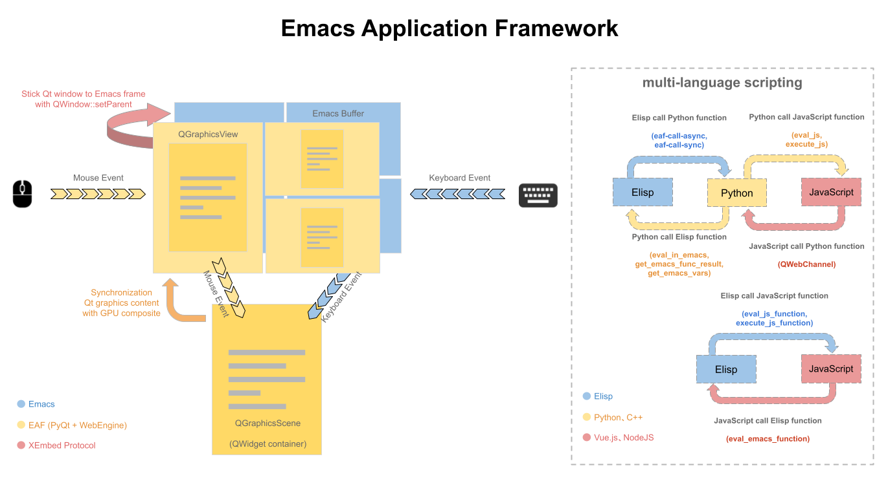

English | [简体中文](./README.zh-CN.md)

<p align="center">
  
  <br>A free/libre and open-source extensible framework that revolutionizes the graphical capabilities of Emacs, <br>the key to ultimately <i>Live in Emacs</i>
</p>

## Vision
Emacs, the extensible *text editor*, is more than 45 years old. It is older than virtually all operating systems people use today, almost as old as the first UNIX system. During the decades of development, the world's brightest hackers have contributed their intelligence and creativity, together they've constructed the most comprehensive and richest ecosystem that you can find in any software to date.

If you are a hacker who works with numerous languages and text, who's keyboard-driven and desires maximum freedom, extensibility, and introspectivity over your tool, maybe to the extent of *living* in it, Emacs will be your best bet.

Unfortunately, this 45 years of age is also one of the greatest disadvantages of Emacs. Comparing with modern software, Emacs lacks performance, specifically Emacs Lisp lacks performance, it doesn't have proper multithreading and its graphical capabilities are seriously limited. It is far from what you'd expect on every GUI application today (such as IDEA or VSCode). You may think that Emacs, as a text-centric editor, doesn't need them, but have you ever run into a situation that, you sit comfortably typing commands and doing your Emacs sorcery, but can't stop to ponder:

    What if Emacs has a real browser?
    What if this PDF or video file can be viewed efficiently without leaving Emacs?

Emacs, although infinitely extensible in text, is very limited in graphics. It shouldn't have to be this way. However, Emacs Lisp is *the* integral part of the Emacs culture, it carries decades of history with itself, it is what makes Emacs special. It is irreplaceable.

The vision of the Emacs Application Framework (EAF) project is that, while fully retaining the rich history, culture and ecosystem of Emacs and Emacs Lisp, to open up completely new doors to the ecosystems of Python, Qt5, and even JavaScript. EAF extends Emacs to the world of modern graphics, but still preserving the extensibility and customizability of Emacs, it will be the key to ultimately *Live in Emacs*.


## Applications

EAF is very extensible, it already comes with a number of useful applications by default:

| Browser                                          | PDF Viewer |
| :--------:                                       | :----:                                                      |
|  |  |

| Music Player                            | File Manager                              |
| :--------:                                            | :----:                                                |
|  |  |
|                                                       |                                                       |

- [Browser](https://github.com/emacs-eaf/eaf-browser): Full-featured browser
- [PDF Viewer](https://github.com/emacs-eaf/eaf-pdf-viewer): The fastest PDF reader
- [Terminal](https://github.com/emacs-eaf/eaf-terminal): Full-featured terminal
- [Video Player](https://github.com/emacs-eaf/eaf-video-player): Video player base on Qt
- [Markdown Previewer](https://github.com/emacs-eaf/eaf-markdown-previewer): Markdown file previewer in Emacs
- [Org Previewer](https://github.com/emacs-eaf/eaf-org-previewer): Org file previewer in Emacs
- [Music Player](https://github.com/emacs-eaf/eaf-music-player): Music player, support playlist and an audio visualization
- [File Manager](https://github.com/emacs-eaf/eaf-file-manager): File manager, support file real-time preview
- [Mindmap](https://github.com/emacs-eaf/eaf-mindmap): Mindmap with full-featured keyboard operation
- [Jupyter](https://github.com/emacs-eaf/eaf-jupyter): Jupyter in Emacs
- [Image Viewer](https://github.com/emacs-eaf/eaf-image-viewer): Picture viewer, supporting real-time zoom rotation
- [Camera](https://github.com/emacs-eaf/eaf-camera): Use camera in Emacs
- [System Monitor](https://github.com/emacs-eaf/eaf-system-monitor): System monitor base on Vue.js
- [Netease Cloud Music](https://github.com/emacs-eaf/eaf-netease-cloud-music): EAF frontend for NetEase cloud music
- [File Browser](https://github.com/emacs-eaf/eaf-file-browser): Browse file in mobile phone
- [File Sender](https://github.com/emacs-eaf/eaf-file-sender): Share file between Emacs and mobile phone
- [Airshare](https://github.com/emacs-eaf/eaf-airshare): Share text between Emacs and mobile phone
- [Demo](https://github.com/emacs-eaf/eaf-demo): EAF Application demo base on Qt
- [Vue Demo](https://github.com/emacs-eaf/eaf-vue-demo): EAF Application demo base on Vue.js

In theory, you can use EAF to integrate any Qt5/Vue.js application into Emacs.

EAF supports Linux and Windows, while macOS and FreeBSD support are in beta, some applications may not work normally.

## EmacsConf2020 - Extend Emacs to Modern GUI Applications with EAF
- EAF talk & demo at EmacsConf2020, presented to you by [MatthewZMD](https://github.com/MatthewZMD)
- Homepage (Q&A included): https://emacsconf.org/2020/talks/34/
- Youtube link:

[](https://www.youtube.com/watch?v=HK_f8KTuR0s)

## Install
#### 1. Download EAF

```Bash
git clone --depth=1 -b master https://github.com/emacs-eaf/emacs-application-framework.git ~/.emacs.d/site-lisp/emacs-application-framework/
```

- Alternatively, you can use a [Quelpa recipe](https://github.com/quelpa/quelpa)

    ```Emacs-lisp
    (quelpa '(eaf :fetcher github
                  :repo  "emacs-eaf/emacs-application-framework"
                  :files ("*")))
    ```

#### 2. Install EAF dependencies

You can use `M-x eaf-install` or manually run the `install-eaf.py` script in the EAF directory:

```Bash
cd emacs-application-framework
chmod +x ./install-eaf.py
./install-eaf.py
```

There are many useful flags available for `install-eaf.py`, check it yourself using `--help`.

#### 3. Load EAF:

From here on, you can either add the full path to the EAF installation directory to your Emacs ```load-path```, then add the following to `init.el`:

```Elisp
(add-to-list 'load-path "~/.emacs.d/site-lisp/emacs-application-framework/")
(require 'eaf)
```

- Alternatively, if you use [use-package](https://github.com/jwiegley/use-package), you can use the following *sample* configuration for your convenience.

    ```Elisp
    (use-package eaf
      :load-path "~/.emacs.d/site-lisp/emacs-application-framework" ; Set to "/usr/share/emacs/site-lisp/eaf" if installed from AUR
      :custom
      (eaf-browser-continue-where-left-off t)
      :config
      (setq eaf-browser-enable-adblocker t")
      (eaf-bind-key scroll_up "C-n" eaf-pdf-viewer-keybinding)
      (eaf-bind-key scroll_down "C-p" eaf-pdf-viewer-keybinding)
      (eaf-bind-key take_photo "p" eaf-camera-keybinding)
      (eaf-bind-key nil "M-q" eaf-browser-keybinding)) ;; unbind, see more in the Wiki
    ```

#### 4. Load EAF apps:

You can use below code to load applications `browser` and `pdf-viewer` that you installed, please check [Applications](https://github.com/emacs-eaf/emacs-application-framework#applications) for the full list:

```Elisp
(require 'eaf-browser)
(require 'eaf-pdf-viewer)
...
```

#### 5. Hooray!

Congratulations, you just installed EAF! You can try `M-x eaf-open-demo` (that is if you have `demo` installed, of course) to see if everything works properly, and enjoy the new possibilities of Emacs.

I **highly** encourage you to read the [Wiki](#Wiki) and [FAQ](#FAQ) if you have any questions.

Also, I encourage periodically `git pull` **and** run `install-eaf.py` again to update EAF, applications, and relating dependencies. If you encounter a bug while using it, see the instruction on how to [Report bug](#report-bug)

### Dependency List

| Package                        | Description                                           |
| :--------                      | :------                                               |
| python-epc                     | EPC for Python                                        |
| python-pyqt5, python-pyqt5-sip | Essential GUI library                                 |
| python-pyqtwebengine           | Chromium-based web rendering engine                   |
| wmctrl                         | Activate Emacs window input focus                     |
| pygetwindow                    | Activate Emacs window input focus on WSL from Windows |
| mac-app-frontmost              | Monitor frontmost app on macOS                        |
| nodejs                         | Installs dependencies, and for app communications     |

You can check `app/name/dependencies.json` and `app/name/package.json` for application level dependencies.

## Launch EAF Applications
| Application Name    | Launch                                                                 |
| :--------           | :----                                                                  |
| Browser             | `M-x eaf-open-browser` Search or Goto URL                              |
|                     | `M-x eaf-open-browser-with-history` Search or Goto URL or Goto History |
| HTML Email Renderer | `M-x eaf-open-mail-as-html` in `gnus`, `mu4e`, `notmuch` HTMl Mail     |
| PDF Viewer          | `M-x eaf-open` PDF File                                                |
| Video Player        | `M-x eaf-open` Video File                                              |
| Image Viewer        | `M-x eaf-open` Image File                                              |
| Markdown Previewer  | `M-x eaf-open` Markdown File                                           |
| Org Previewer       | `M-x eaf-open` Org File                                                |
| Camera              | `M-x eaf-open-camera`                                                  |
| Terminal            | `M-x eaf-open-terminal`                                                |
| File Manager   | `M-x eaf-open-in-file-manager`                                    |
| File Sender         | `M-x eaf-file-sender-qrcode` or `eaf-file-sender-qrcode-in-dired`      |
| File Browser        | `M-x eaf-file-browser-qrcode`                                          |
| Airshare            | `M-x eaf-open-airshare`                                                |
| Mindmap             | `M-x eaf-create-mindmap` or `M-x eaf-open-mindmap`                     |
| MS Office Viewer    | `M-x eaf-open-office`                                                  |
| Jupyter             | `M-x eaf-open-jupyter`                                                 |
| Music Player        | `M-x eaf-open-music-player`                                            |
| System Monitor      | `M-x eaf-open-system-monitor`                                          |
| Demo                | `M-x eaf-open-demo` to verify basic functionality                      |
| Vue Demo            | `M-x eaf-open-vue-demo` to verify vue.js functionality                 |

- EAF Browser and PDF Viewer support Emacs built-in bookmark operation, with `M-x bookmark-set` (defaulted to `C-x r m`) and `M-x bookmark-bmenu-list` (defaulted to `C-x r l`).

## Keybindings

### Global Keybindings

  | Key   | Event                       |
  | :--   | :--                         |
  | `C-h m` | eaf-describe-bindings       |
  | `C-c b` | eaf-open-bookmark           |
  | `C-c e` | eaf-open-external           |
  | `C-c i` | eaf-import-chrome-bookmarks |
  | `M-/`   | eaf-get-path-or-url         |
  | `M-'`   | eaf-toggle-fullscreen       |
  | `M-[`   | eaf-share-path-or-url       |

### Bottom Pop Edit Buffer Keybindings

  | Key     | Event                              |
  | :--     | :--                                |
  | `C-c C-c` | eaf-edit-buffer-confirm            |
  | `C-c C-k` | eaf-edit-buffer-cancel             |
  | `C-c C-t` | eaf-edit-buffer-switch-to-org-mode |

## Wiki

It is **highly** suggested to read the [Wiki](https://github.com/emacs-eaf/emacs-application-framework/wiki) first before using EAF.

The wiki consists of documentations on:
* Keybindings
* Customization
* Design
* TODOLIST

There also are some helpful tips to make EAF work with Docker, Helm, etc.

## FAQ

### How does EAF work?
<p align="center">
  
</p>

EAF implements three major functionalities:
1. Integrate PyQt program window into Emacs frame using QWindow Reparent technology.
2. Listen to EAF buffer's keyboard event flow and control the keyboard input of the PyQt program via Python EPC.
3. Create a window composite to make a PyQt program window adapt Emacs' Window/Buffer design.

Learn more from the [Wiki](https://github.com/emacs-eaf/emacs-application-framework/wiki/Hacking)!

### EAF vs EXWM?
1. EAF and EXWM share a common goal: enhance collaboration between the standard GNU Emacs with other GUI tools.
2. EXWM is an X11 Window Manager, it manages and controls other software using a keyboard, but it cannot modify, customize and extend the behavior of other software.
3. EAF is *not* a Window Manager, it utilizes the windows managing capabilities of Emacs to display its applications.
4. EAF intends to provide a framework to write PyQt5 applications that extends the multimedia experience of Emacs. From the perspective of Emacs' buffer/mode design, EAF is not different from any other package, with the former uses Qt for drawing contents while the latter uses Emacs' built-in text libraries instead.
5. Through EAF's design, one can use Elisp to control Python and vice versa, and even able to use Elisp to control JavaScript in EAF Browser. EAF enables Emacs to the world of **multi-language scripting**.

Both projects are similar in terms of interface, but they are two completely different projects with different goals in mind. Sometimes one may find EAF is more suitable than EXWM, sometimes it's the other way around. Please do not meaninglessly compare them.

### macOS
Currently, macOS is only partially supported and needs a lot of testing, not all functions can work normally, please check the [Wiki](https://github.com/emacs-eaf/emacs-application-framework/wiki/macOS) for details.

### Browser crashes
Please DO NOT install PyQt5 through pip, pip version has a bug, please install PyQt5 from the OS software repository.

### Why doesn't EAF receive input events on Linux Window Manager?
EAF confirms that the desktop environment or window manager you can work with includes: KDE, Gnome2, Gnome3, Mate, Xfce, LXDE, Sway, i3, QTile, Xpra, EXWM.

We suspect there are some issues with how all the Window Managers implement their x11 protocols.

One workaround is to name of command `wmctrl -m` to the elisp list `eaf-wm-focus-fix-wms`. Fill an issue if it still doesn't work.

### Proxy
If you need to use a proxy to access the internet, one can configure the proxy settings.

```Elisp
(setq eaf-proxy-type "http")
(setq eaf-proxy-host "127.0.0.1")
(setq eaf-proxy-port "1080")
```

If you use Socks5 as a local proxy, one can set proxy type with:

```Elisp
(setq eaf-proxy-type "socks5")
```

## EAF in the community

A list of other community packages that use EAF to enhance their graphical experiences!

If we missed your package, please make a PR to add it to the list.

* ***[obr-viz](https://github.com/swhalemwo/obr-viz)***: visualizing [org-brain](https://github.com/Kungsgeten/org-brain) relationships using EAF
* ***[netease-cloud-music](https://github.com/SpringHan/netease-cloud-music.el)***: A netease music client for emacs.

## Report bug

### For any installation and configuration assistance, please read the [Wiki](https://github.com/emacs-eaf/emacs-application-framework/wiki) first!

If you encounter a problem with EAF, and it occurred after pulling the latest commit, please check the [Mandatory Procedures to Keep Your EAF Up-To-Date](https://github.com/emacs-eaf/emacs-application-framework/discussions/527?sort=new) page **first**.

For any other problems, please use `emacs -q` and load a minimal setup with only EAF to verify that the bug is reproducible. If `emacs -q` works fine, probably something is wrong with your Emacs config.

If the problem persists, please report it [here](https://github.com/emacs-eaf/emacs-application-framework/issues/new) with `*eaf*` buffer content, it contains many clues that can help us locate the problem faster.

If you get a segfault error, please use the following way to collect crash information:
1. Install gdb and turn on option `eaf-enable-debug`
2. Use the command `eaf-stop-process` to stop the current process
3. Restart eaf, send issue with `*eaf*` buffer content when next crash

## Join Us
Do you want to make Emacs a real "operating system"?

Do you want to live in Emacs more comfortably?

Do you want to revolutionize the capabilities of Emacs?

[Let's hack together!](https://github.com/emacs-eaf/emacs-application-framework/wiki/Hacking)

## 打赏
如果我的作品让你的生活充满快乐, 欢迎请我喝瓶啤酒, 哈哈哈哈

### ManateeLazyCat
<p float="left">
    
    
</p>
