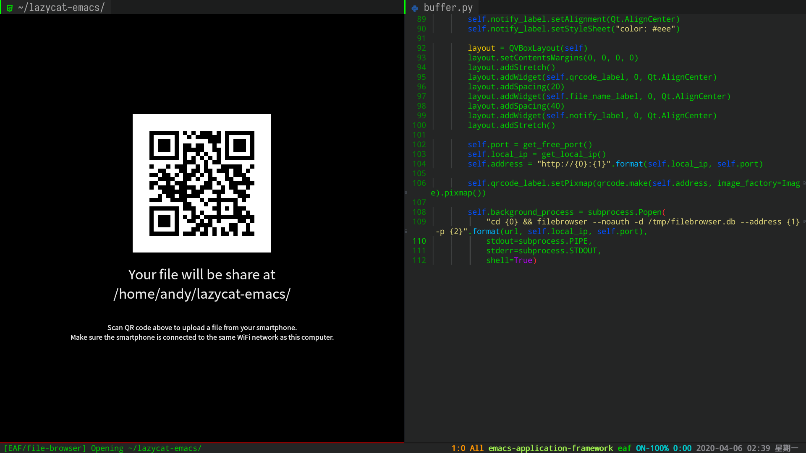
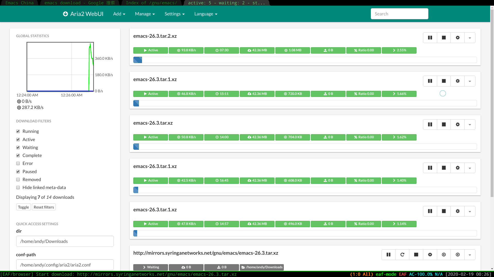
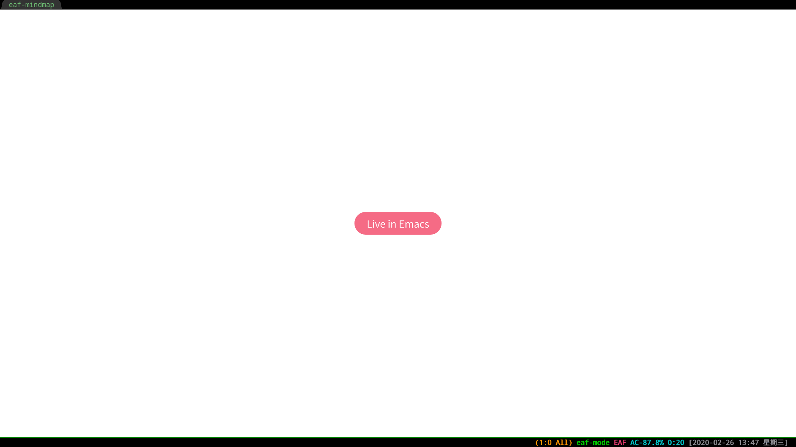
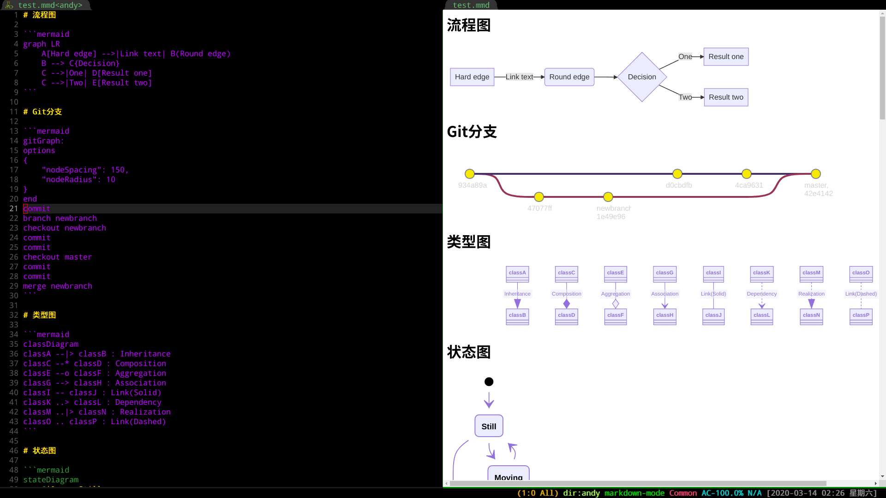
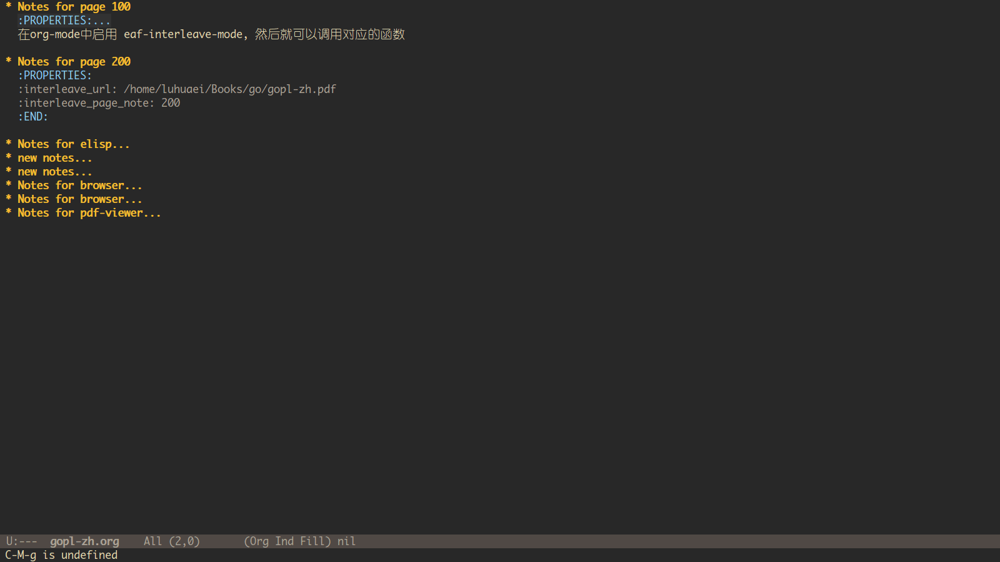
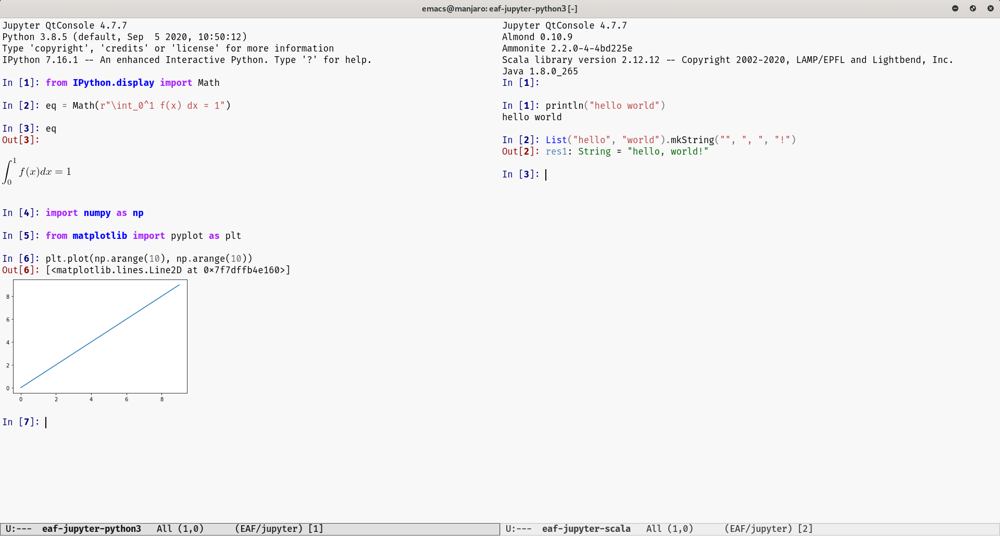

[English](./README.md) | 简体中文

# Emacs Application Framework (EAF)
EAF 是一个全新的图形应用框架，通过扩展Emacs的多媒体能力，最终达到 Live in Emacs 的终极目标。

## EAF 应用展示
EAF是一个可编程扩展的框架，你可以开发自己的Qt5应用并集成在Emacs中。

| 浏览器                                           | Markdown预览程序                                    |
| :--------:                                       | :----:                                                      |
|  |  |

| 图片浏览器                                            | 视频播放器                                            |
| :--------:                                            | :----:                                                |
|  |  |
|                                                       |                                                       |

| PDF阅读器                                       | 摄像头程序                                     |
| :--------:                                          | :----:                                          |
|  |  |
|                                                     |                                                 |

| 二维码下载文件 (PC到手机)                              | 二维码上传文件 (手机到PC)                                 |
| :--------:                                             | :----:                                                 |
|  |  |
|                                                        |                                                        |


| 无线文字传输程序                                   | Org预览                                                |
| :--------:                                         | :--------:                                             |
|  |  |
|                                                    |                                                        |

| 终端模拟器                                        | RSS阅读器 (集成Elfeed)                                           |
| :--------:                                        | :------:                                            |
|  |  |
|                                                   |                                                     |

| Aria2 下载管理器                               | 思维导图                                         |
| :--------:                                     | :-------:                                        |
|  |  |
|                                                |                                                  |

| 流程图                                           | 笔记管理系统                                            |
| :--------:                                       | :--------:                                              |
|  |  |
|                                                  |                                                         |

| Jupyter                                          |                                                         |
| :--------:                                       | :--------:                                              |
|  |                                                         |
|                                                  |                                                         |

## EmacsConf2020 - Extend Emacs to Modern GUI Applications with EAF（暂无中文字幕）
- 由[MatthewZMD](https://github.com/MatthewZMD)在EmacsConf2020的演讲和demo。
- 官网（内附Q&A）: https://emacsconf.org/2020/talks/34/
- Youtube链接:

[](https://www.youtube.com/watch?v=HK_f8KTuR0s)

## 安装
1. 下载EAF:
```Bash
git clone --depth=1 -b master https://github.com/manateelazycat/emacs-application-framework.git ~/.emacs.d/site-lisp/emacs-application-framework/
```

你也可以通过[Quelpa](https://github.com/quelpa/quelpa)来下载
```Emacs-lisp
(quelpa '(eaf (:fetcher github
               :repo  "manateelazycat/emacs-application-framework"
               :files ("*"))))
```

2. 通过`M-x install-eaf-dependencies`安装EAF依赖，

如果你更喜欢手动执行安装脚本，

- GNU/Linux用户：

```Bash
cd emacs-application-framework
chmod +x ./install-eaf.sh
./install-eaf.sh
```

- Windows用户：

```shell
>>>>>>> Update README and eaf-install-dependencies (need Windows testing)
cd emacs-application-framework
node ./install-eaf-win32.js
```

脚本里安装的每一个依赖的解释可以在[依赖列表](#依赖列表)找到。

3. 安装Elisp依赖包:
- [emacs-ctable](https://github.com/kiwanami/emacs-ctable)
- [emacs-deferred](https://github.com/kiwanami/emacs-deferred)
- [emacs-epc](https://github.com/kiwanami/emacs-epc)

4. 从这里开始，你可以把EAF加入Emacs的 ```load-path```，然后在 `init.el` 中写入:

```Elisp
(add-to-list 'load-path "~/.emacs.d/site-lisp/emacs-application-framework/")
(require 'eaf)
```

或者，如果你使用[use-package](https://github.com/jwiegley/use-package)，下面有一个简单的配置文件供你参考:

```Elisp
(use-package eaf
  :load-path "~/.emacs.d/site-lisp/emacs-application-framework" ; Set to "/usr/share/emacs/site-lisp/eaf" if installed from AUR
  :init
  (use-package epc :defer t)
  (use-package ctable :defer t)
  (use-package deferred :defer t)
  (use-package s :defer t :ensure t)
  :custom
  (eaf-browser-continue-where-left-off t)
  :config
  (eaf-setq eaf-browser-enable-adblocker "true")
  (eaf-bind-key scroll_up "C-n" eaf-pdf-viewer-keybinding)
  (eaf-bind-key scroll_down "C-p" eaf-pdf-viewer-keybinding)
  (eaf-bind-key take_photo "p" eaf-camera-keybinding)
  (eaf-bind-key nil "M-q" eaf-browser-keybinding)) ;; unbind, see more in the Wiki
```

### 依赖列表
**核心** 分类代表必备依赖，这些包必须安装好EAF才能工作。其余依赖都可选，若想其使用对应的应用时，你才需要安装这些依赖。当然我们推荐先把所有依赖都安装好，等到真正使用的时候就不用再次折腾。

| 包名                           | 依赖                         | 解释                                     |
| :--------                      | :------                      | :------                                  |
| python-pyqt5, python-pyqt5-sip | 核心                         | GUI图形库                                |
| python-pyqtwebengine           | 核心                         | 基于Chromium的浏览器引擎                 |
| wmctrl           | 核心                         | 激活Emacs窗口输入焦点                 |
| python-pymupdf                 | PDF阅读器                    | 解析PDF文件                              |
| python-grip                    | Markdown预览                 | 建立Markdown文件的HTML服务               |
| python-qrcode                  | 文件上传，文件下载，文字传输 | 根据文件信息生成二维码                   |
| python-markdown                | 流程图                       | 转换 mmd 格式为 mermaid 识别的 html 格式 |
| aria2                          | 浏览器                       | 下载网络文件                             |
| nodejs                         | 终端模拟器                   | 通过浏览器与本地TTY交互                  |
| libreoffice                    | 办公文档阅读器               | 转换doc文件为pdf格式                     |
| filebrowser-bin                | 文件浏览器                   | 在电脑和手机之间快速共享文件             |
| qtconsole                      | jupyter                      | 提供RichJupyterWidget                    |

## EAF应用启动命令
| 应用名称         | 启动命令                                                                    |
| :--------        | :----                                                                       |
| 浏览器           | `M-x eaf-open-browser` 在浏览器中打开或搜索                                 |
|                  | `M-x eaf-open-browser-with-history` 搜索历史或者打开URL                     |
| HTML邮件渲染     | `M-x eaf-open-mail-as-html` 在 `gnus`，`mu4e`，`notmuch` 等邮件客户端中执行 |
| PDF阅读器        | `M-x eaf-open` 输入PDF文件                                                  |
| 视频播放器       | `M-x eaf-open` 输入视频文件                                                 |
| 图片浏览器       | `M-x eaf-open` 输入图片文件                                                 |
| Markdown预览     | `M-x eaf-open` 输入Markdown文件                                             |
| Org预览          | `M-x eaf-open` 输入Org文件                                                  |
| 摄像头程序       | `M-x eaf-open-camera`                                                       |
| 终端模拟器       | `M-x eaf-open-terminal`                                                     |
| 二维码下载文件   | `M-x eaf-file-sender-qrcode` or `eaf-file-sender-qrcode-in-dired`           |
| 二维码在线浏览器 | `M-x eaf-file-browser-qrcode`                                               |
| 无线分享         | `M-x eaf-open-airshare` 输入要分享给手机的字符串                            |
| 思维导图         | `M-x eaf-create-mindmap` or `M-x eaf-open-mindmap`                          |
| 微软Office阅读器 | `M-x eaf-open-office`                                                       |
| 流程图           | `M-x eaf-open` 输入 mmd 格式文件                                            |
| jupyter          | `M-x eaf-open-jupyter`                                                      |
| 演示程序         | `M-x eaf-open-demo`                                                         |

- EAF浏览器以及PDF浏览器支持Emacs内置书签操作，通过使用`M-x bookmark-set`（默认`C-x r m`）以及`M-x bookmark-bmenu-list`（默认`C-x r l`）。

## Wiki
强烈建议使用EAF之前浏览一遍[Wiki](https://github.com/manateelazycat/emacs-application-framework/wiki)。

Wiki囊括了各种你想了解的EAF相关文档，包括了：
1. 按键绑定
2. 自定义选项
3. 架构设计
4. 任务列表

你还会在Wiki发现很多有用的技巧，如Docker，Helm等，

## 常用问题

### EAF是怎么工作的？
EAF主要实现这几个功能：
1. 利用QWindow的Reparent技术来实现PyQt应用进程的窗口粘贴到Emacs对应的Buffer区域
2. 通过Python EPC来实现Emacs进程和Python进程的控制指令和跨进程消息通讯
3. 通过Qt5的QGraphicsScene来实现镜像窗口，以对应Emacs的Buffer/Window模型

若想了解更多EAF设计背景，请看[Wiki](https://github.com/manateelazycat/emacs-application-framework/wiki/Hacking)

### EAF vs EXWM?
1. EAF和EXWM的共同点都是：“提升Emacs和别的程序的协作效率“
2. EXWM是一个X11窗口管理器，通过X11协议来控制Emacs和其他程序，但是EXWM只是管理其他程序，但是它并不会修改应用程序的内在行为。
3. EAF不是一个窗口管理器，EAF只是依赖Emacs自身的窗口管理功能显示自己
4. EAF的目标是通过PyQt创造新的应用来扩展Emacs的多媒体能力。从Emacs本身的Buffer/Mode设计上看，它和你平常用的 `xx-mode` 插件没有啥区别，只是它用Qt来绘制内容，而不是Emacs自身的文本库来绘制内容
5. EAF通过造轮子的方式，把大多数程序员常用的应用写出来以后，达到Live in Emacs的最终目标
6. 基于EAF的架构设计，我们可以通过Elisp来控制Python，JavaScript和其他命令行工具，实现多语言扩展Emacs的编程模型。在坚持Emacs黑客文化和Elisp社区兼容性的前提下，让Emacs的多媒体能力能够跟上时代的发展

或许EAF和EXWM看起来有点相似，但它们在设计和理念上是两个完全不同的项目。所以请大家多多学习X11和Qt的区别，理解技术的本质，避免无意义的比较和争论。

### 为什么EAF无法在MacOS下工作？
1. Qt5的QGraphicsScene技术无法在MacOS下正常工作，也就无法实现Qt5应用的镜像窗口以支持Emacs的Buffer/Window模型
2. QWindow Reparent技术无法在MacOS下正常工作，也就无法实现Qt应用进程的窗口粘贴到Emacs对应的Buffer区域

### 为什么通过窗口管理器使用EAF无法接收输入信息？
EAF确认可以工作的桌面环境或者窗口管理器包括：KDE、Gnome2、Gnome3、Mate、XFce、LXDE、i3、QTile、Xpra.

我们认为不同的窗口管理器对于X11协议的支持不够完善才导致这样的问题。

现在的解决方案是将命令`wmctrl -m`中Name的值加入`eaf-wm-focus-fix-wms`，如果还有问题，请在Github提出issue。

### Github 个人访问标记干什么用的？
Markdown预览程序依赖grip，你需要访问[Github Personal access token](https://github.com/settings/tokens/new?scopes=)去获取你个人的标记，然后通过下面的命令设置标记后，grip才能正常的工作：

```Elisp
(setq eaf-grip-token "yourtokencode")
```

尽管不设置访问标记一开始也能成功使用，但Github过段时间会弹出 "GitHub Rate Limit Reached" 的错误。

### 代理
可以通过下面设置来通过代理访问互联网：

```Elisp
(setq eaf-proxy-type "http")
(setq eaf-proxy-host "127.0.0.1")
(setq eaf-proxy-port "1080")
```

如果你使用Socks5代理，你可以设置代理类型为：

```Elisp
(setq eaf-proxy-type "socks5")
```

## EAF社区

下面列表列展示了EAF在Emacs社区的应用。如果我们遗漏你的应用，欢迎提交PR来加到下面列表中。

* ***[obr-viz](https://github.com/swhalemwo/obr-viz)***: visualizing [org-brain](https://github.com/Kungsgeten/org-brain) relationships using EAF

## 反馈问题

### 反馈安装和配置问题之前，请一定先阅读[Wiki](https://github.com/manateelazycat/emacs-application-framework/wiki)!!!

如果你使用中遇到任何问题，并且问题是`git pull`后出现的，请先阅读[Discussions](https://github.com/manateelazycat/emacs-application-framework/discussions/527)页面。

关于其他问题，请用命令 `emacs -q` 并只添加EAF配置做一个对比测试，如果 `emacs -q` 可以正常工作，请检查你个人的配置文件。

如果`emacs -q`环境下问题依旧，请到[这里](https://github.com/manateelazycat/emacs-application-framework/issues/new)反馈, 并附带 `*eaf*` 窗口的内容给我们提交issue，那里面有很多线索可以帮助我们排查问题。。

如果你遇到崩溃的问题, 请用下面的方式来收集崩溃信息:
1. 先安装gdb并打开选项 `eaf-enable-debug`
2. 使用命令 `eaf-stop-process` 停止EAF进程
3. 重新打开EAF, 并在下次崩溃时发送 `*eaf*` 的内容

## 加入我们
你想把Emacs开发成一个操作系统吗？

想要在Emacs里面生活的更舒适吗？

想要创建下一个激动人心的Emacs插件吗？

[一起疯吧!](https://github.com/manateelazycat/emacs-application-framework/wiki/Hacking)

## 打赏
如果我的作品让你的生活充满快乐，欢迎请我喝瓶啤酒，哈哈哈哈

### ManateeLazyCat
<p float="left">
    
    
</p>
