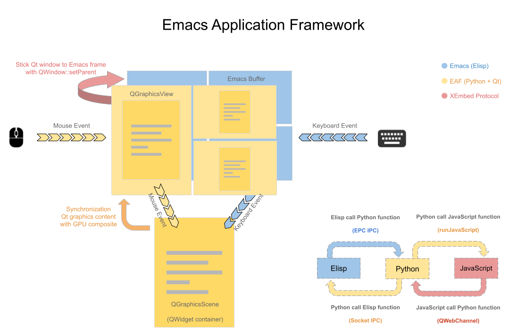

## The Framework of EAF



* QGraphicsScene similar Emacs' buffer, control content and state.
* QGraphicsView similar Emacs' window, control size and position.
* Every change in QGraphicsScene will synchronization to QGraphicsView in realtime by GPU composite.
* We use Xlib XReparent technology stick QGraphicsView to Emacs frame.
* Destroy QGraphicsView if emacs eaf-mode's window hide, create new QGraphicsView if eaf-mode window show, but QGraphicsScene still live in background until user kill eaf-mode buffer.
* When user use mouse click on QGraphicsView, QGraphicsView will translate mouse event coordinate and pass mouse event to QGraphicsScene to handle.
* When user use keyboard input in Emacs buffer, Emacs will key event to QGraphicsScene throught DBus IPC.
* Elisp call Python function through DBus method.
* Python call Elisp function through DBus signal.

## Why choose Qt?
Qt's QGraphicsView and QGraphicsScene is awesome, it's easier to implement window composite than other GUI library (such as GTK+).

If use Gtk+ or other GUI library, I need write many Widget/XComposite code to implement widget like QGraphicsView/QGraphicsScene.

## Why choose Python?
C/C++ need compile long time for every change, this will interrupt my attention and enthusiasm of development.

Python is a perfect language to develop Qt program and it can call pretty much in every library you need.

## Let me run hello word
```
M-x eaf-open-demo
```

    This will pop hello world window in emacs like below:

| Demo                                                  |
| :--------:                                            |
|  |


    It's a big hello button, try to click it, haha.

## Develop new plugin
It's very easy if you know how to write PyQt5 code.

Here have awesome tutorial help you study PyQt5: http://zetcode.com/gui/pyqt5/

Trust me, PyQt5 is pretty easy to study.

After you know how to write PyQt5 code, developing new plugin just needs 3 steps:

1. Open file [buffer.py](app/demo/buffer.py):
```Python
from PyQt5.QtGui import QColor
from PyQt5.QtWidgets import QPushButton
from core.buffer import Buffer

class AppBuffer(Buffer):
    def __init__(self, buffer_id, url, arguments):
        Buffer.__init__(self, buffer_id, url, arguments, True, QColor(0, 0, 0, 255))

        self.add_widget(QPushButton("Hello, EAF hacker, it's work!!!"))
        self.buffer_widget.setStyleSheet("font-size: 100px")
```

    Replace QPushButton with your PyQt5 widget.

* buffer_id and url are need by framework, you just need pass those paramaters to Buffer class

* third paramater True mean application content will fit size with emacs window size change, such as image viewer.

* third paramater False mean applicaton content won't fit size with emacs window size change, such as browser.

* fourth paramater is background color to fill application background.

2. Open file [eaf.el](core/eaf.el):
```Elisp
...

(defun eaf-open (url &optional app-name)
  (interactive "FOpen with EAF: ")
  (unless app-name
    (cond ((string-equal url "eaf-demo")
           (setq app-name "demo"))

...
```

    Replace "eaf-demo" to "eaf rocks!"

3. Test
```
Execute command `eaf-stop-process' to kill old python process.

Execute command `eaf-start-process' to start new python process.

Execute command `eaf-open' and type "eaf rocks!".
```


See? It's so easy!

Above are all you need, happy hacking!

## Other APIs

### Show message in emacs' minibuffer.

If you want show message in emacs' minibuffer, you can emit AppBuffer's signal "message_to_emacs" like below:

```Python
self.message_to_emacs.emit("hello from eaf")
```

### Read user's input
Below is code example from pdfviewer:
```Python
...

class AppBuffer(Buffer):
    def __init__(self, buffer_id, url, arguments):
        Buffer.__init__(self, buffer_id, url, arguments, False, QColor(0, 0, 0, 255))

        self.add_widget(PdfViewerWidget(url, QColor(0, 0, 0, 255)))
        self.buffer_widget.send_jump_page_message.connect(self.send_jump_page_message)

    def send_jump_page_message(self):
        self.send_input_message("Jump to: ", "jump_page")

    def handle_input_message(self, result_type, result_content):
        if result_type == "jump_page":
            self.buffer_widget.jump_to_page(int(result_content))

...
```
If you want read input from emacs minibuffer then call back to python.

You can emit buffer signal "send_input_message", first argument is prompt string to user, second argument is callback_type for interface "handle_input_message".

After emacs read user input, framework will call interface "handle_input_message", result_type is callback_type you use in signal "send_input_message", result_content is input string from emacs.

Simple logic is send "send_input_message" signal to emacs, then handle user input with buffer interface "handle_input_message"

### Scroll by other window
In emacs, we usually call command "scroll-other-window" to scroll other window's buffer.

If you want eaf application buffer respond scroll event to command "scroll-other-window".

You need implement "scroll" interface in AppBuffer, such as like PDF Viewer does:

```Python
    def scroll(self, scroll_direction, scroll_type):
        if scroll_type == "page":
            if scroll_direction == "up":
                self.buffer_widget.scroll_up_page()
            else:
                self.buffer_widget.scroll_down_page()
        else:
            if scroll_direction == "up":
                self.buffer_widget.scroll_up()
            else:
                self.buffer_widget.scroll_down()
```

Argument "scroll_direction" is string, "up" mean scroll buffer up, "down" mean scroll buffer down.

Argument "scroll_type" is string, "page" mean scroll buffer by page, "line" mean scroll buffer by line.

### Save/Restore session
We always need save and restore session for an application, such as, save play position of the video player.

You need implement interfaces "save_session_data" and "restore_session_data", below is an example of Vide Player does:


```Python
    def save_session_data(self):
        return str(self.buffer_widget.media_player.position())

    def restore_session_data(self, session_data):
        position = int(session_data)
        self.buffer_widget.media_player.setPosition(position)
```

Argument "session_data" is string, you can put anything in it

All session data save at ~/.emacs.d/eaf/session.json file.

### Update buffer
If you need to update buffer sometimes, such as update org-file previewer after saving org-file.

You need to implement the interface "update_with_data". Below is an example of what Org Previewer does:

```Python
    def update_with_data(self, update_data):
        self.load_org_html_file()
        self.buffer_widget.reload()
```

Argument "update_data" is passed from elisp side.

### Update progress.

If your application will do some long-time operation, you can use below use below interfaces of buffer:

```Python
    def start_progress(self):
    def stop_progress(self):
    def update_progress(self, progress):
```

### Customize variable at Elisp side.
You can use below code set the save patch of camera photo:

```Elisp
(eaf-setq 'eaf-camera-save-path "~/Downloads")
```

On the python side, you can use below code pick up the value of ```eaf-camera-save-path```

```Python
self.emacs_var_dict["eaf-camera-save-path"]
```

Above is an example of ```eaf-camera-save-path```, you can customize any variable on elisp side actually, don't need modify python code to customize EAF application!


## Todolist
[Some works you can hacking ;)](TODOLIST.md)
